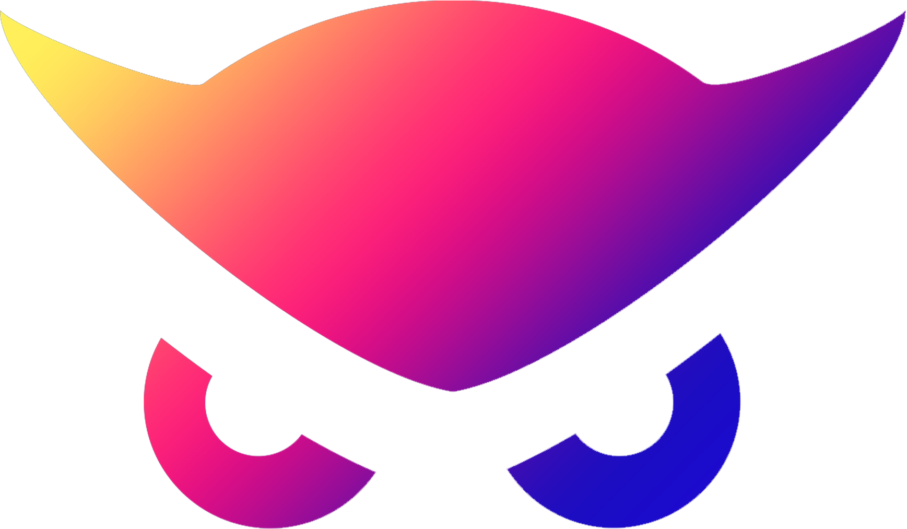

<div id="top"></div>

<!-- project shields -->
<p align="left">
  <!-- discord -->
  <a href="http://discord.gg/W69GTHe3pJ">
    
  </a>
  <!-- telegram -->
  <a href="https://t.me/nightowlcommunity">
    
  </a>
  <!-- reddit -->
  <a href="https://www.reddit.com/r/NightOwlCasino">
    
  </a>
  <!-- mit license -->
  <a href="https://github.com/nightowlcasino/NightOwl-Backend/blob/main/LICENSE">
    
  </a>
</p>

<!-- logo -->
<p align="center">
  
</p>

# NightOwl-Backend

<!-- TABLE OF CONTENTS -->
<details>
  <summary>Table of Contents</summary>
  <ol>
    <li>
      <a href="#about">About</a>
      <ul>
        <li><a href="#built-with">Built With</a></li>
      </ul>
    </li>
    <li><a href="#installation">Installation</a></li>
    <li><a href="#usage">Usage</a></li>
    <li><a href="#roadmap">Roadmap</a></li>
    <li><a href="#ergo-hack-iii-goals">Ergo Hack III Goals</a></li>
    <li><a href="#license">License</a></li>
    <li><a href="#acknowledgments">Acknowledgments</a></li>
  </ol>
</details>
  
<!-- ABOUT -->
## About

<!-- INSTALLATION -->
## Installation

### Install nvm (Mac OS X - Node Version Manager)

```bash
brew install nvm
```

### Install node lts (long-term support) version
```bash
nvm install --lts
```

### Install dependencies
```bash
npm i
```

### start nodejs backend server
```bash
npm run start
```

<!-- USAGE -->
## Usage

### Test API
```bash
curl http://localhost:8080/api/v1/leaderboard
```

<!-- ROADMAP -->
## Roadmap

<!-- ERGOHACK3 -->
## Ergo Hack III Goals

<!-- LICENSE -->
## License

MIT License, see [LICENSE](https://github.com/nightowlcasino/NightOwl-Backend/blob/main/LICENSE).

<!-- ACKNOWLEDGEMENTS -->
## Acknowledgments

This repo structure was based off of the [ergo-js-template repo](https://github.com/anon-real/ergo-js-template)